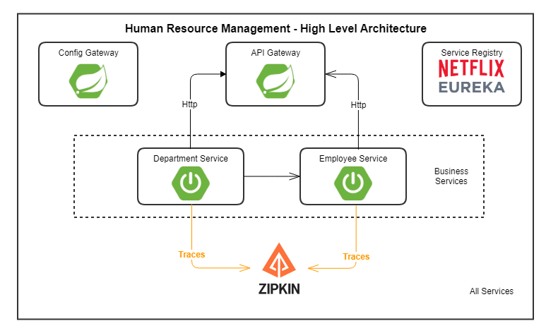

# HR Management Microservices Project

This project is a Human Resources Management system built using Spring Boot, employing microservices architecture.

## Overview

The HR Management project comprises several microservices aimed at handling distinct functionalities:

### Business Services
1. **Employee Service**: Manages employee-related operations.
2. **Department Service**: Handles department-related functionalities.

### Infrastructure Services
1. **API Gateway Service**: Provides a unified entry point for client requests.
2. **Config Server**: Centralized configuration management.
3. **Service Registry (Netflix Eureka)**: Service discovery and registration.

### Distributed Tracing
- **Zipkin**: Utilized for distributed tracing to monitor and troubleshoot microservices interactions.

## High-Level Architecture

The diagram above illustrates the high-level architecture of the HR Management microservices project. It showcases the interactions and connections between various components and services involved.

## Contributing

Feel free to contribute to this project by forking the repository, making improvements, and creating pull requests.

## Notes

Please note that this project does not include detailed documentation for each service. If you have any specific questions or need assistance, feel free to reach out or explore the source code in the individual service directories. .

